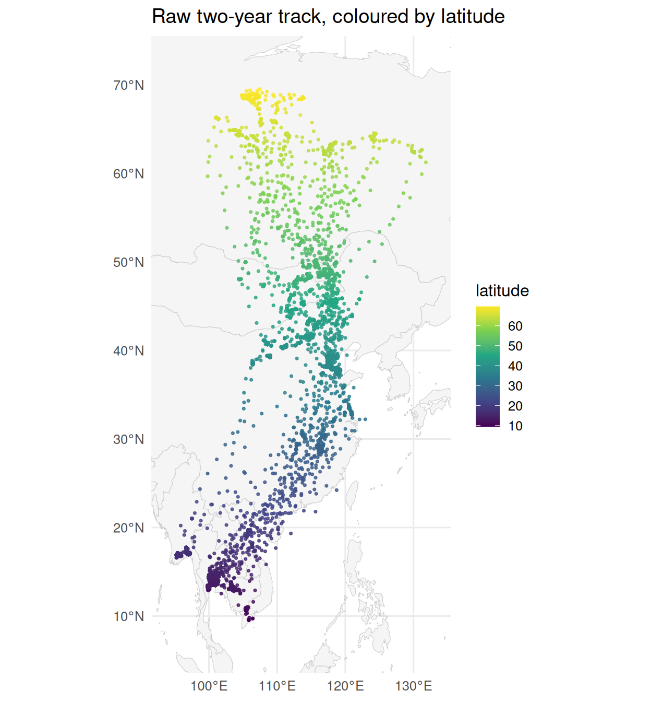
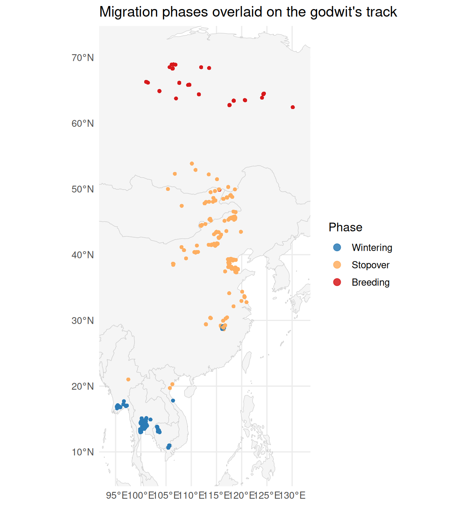

# Data Overview and Per-Species Sampling

### Overview

Reproduces Table 1: per-species individual counts, tracking windows,
sampling intervals, and ethics approvals. (Responds to Reviewer 2 M9.)

### Setup

``` r

library(movepp)
library(sf)
#> Linking to GEOS 3.12.1, GDAL 3.8.4, PROJ 9.4.0; sf_use_s2() is TRUE
library(ggplot2)
```

## Data

This vignette uses **`godwit_demo`**, a bundled subset of GPS tracking
data from one Black-tailed Godwit (*Limosa limosa*) individual, covering
two complete annual migration cycles between the wintering grounds in
coastal Southeast Asia and the breeding grounds in Far East Siberia. The
full nine-individual dataset is analysed in the companion manuscript:

> Xiao H., Peng H., Zhang Z., et al. (in revision). *From Movement to
> Meaning: Spatial Statistics Uncover Hidden Patterns in Tracking Data.*
> Movement Ecology.

``` r

data("godwit_demo")
head(godwit_demo, 10)
#> Simple feature collection with 10 features and 8 fields
#> Geometry type: POINT
#> Dimension:     XY
#> Bounding box:  xmin: 117.432 ymin: 38.75792 xmax: 117.445 ymax: 38.76873
#> Geodetic CRS:  WGS 84
#>                   individual                time      lon      lat speed course
#> 1  Black-tailed Godwit 23_22 2026-04-03 22:00:00 117.4358 38.76675   0.0    115
#> 2  Black-tailed Godwit 23_22 2026-04-03 16:00:00 117.4370 38.75792   2.2    284
#> 3  Black-tailed Godwit 23_22 2026-04-03 10:00:00 117.4436 38.76461   0.0    292
#> 4  Black-tailed Godwit 23_22 2026-04-03 04:00:00 117.4444 38.76367   0.0    168
#> 5  Black-tailed Godwit 23_22 2026-04-02 22:00:00 117.4320 38.76873   0.0     81
#> 6  Black-tailed Godwit 23_22 2026-04-02 16:01:00 117.4408 38.75853   0.0    262
#> 7  Black-tailed Godwit 23_22 2026-04-02 10:00:00 117.4450 38.76349   0.0    169
#> 8  Black-tailed Godwit 23_22 2026-04-02 04:00:00 117.4433 38.76375   0.0    148
#> 9  Black-tailed Godwit 23_22 2026-04-01 22:00:00 117.4362 38.76489   0.0    348
#> 10 Black-tailed Godwit 23_22 2026-04-01 16:00:00 117.4393 38.75895   0.0    150
#>    altitude temperature                  geometry
#> 1         1       21.62 POINT (117.4358 38.76675)
#> 2       457       16.29  POINT (117.437 38.75792)
#> 3        26       23.87 POINT (117.4436 38.76461)
#> 4        97       26.88 POINT (117.4444 38.76367)
#> 5         1       21.18  POINT (117.432 38.76873)
#> 6         5       21.45 POINT (117.4408 38.75853)
#> 7        17       23.87  POINT (117.445 38.76349)
#> 8        16       32.75 POINT (117.4433 38.76375)
#> 9        14       19.53 POINT (117.4362 38.76489)
#> 10       12       21.32 POINT (117.4393 38.75895)
```

The dataset contains 61,410 GPS fixes for one individual, with the
following fields:

- `individual` — individual ID
- `time` — UTC timestamp
- `lon`, `lat` — coordinates in WGS 84
- `speed` — instantaneous speed (m/s)
- `geometry` — sf POINT geometry

``` r

c(fixes       = nrow(godwit_demo),
  individuals = length(unique(godwit_demo$individual)))
#>       fixes individuals 
#>       61410          10
range(godwit_demo$time)
#> [1] "2023-04-13 04:56:00 CST" "2026-05-06 19:00:00 CST"
```

A first look at the raw trajectory, coloured by latitude (the
latitudinal extent illustrates the migratory range). We use the same
`ggplot2` + `rnaturalearth` basemap style as the downstream vignettes:

``` r

world <- rnaturalearth::ne_countries(scale = "medium", returnclass = "sf")
bb    <- sf::st_bbox(godwit_demo)
padx  <- as.numeric(bb["xmax"] - bb["xmin"]) * 0.10
pady  <- as.numeric(bb["ymax"] - bb["ymin"]) * 0.10

ggplot() +
  geom_sf(data = world, fill = "grey96", colour = "grey80", linewidth = 0.2) +
  geom_sf(data = godwit_demo, aes(colour = lat), size = 0.6, alpha = 0.8) +
  scale_colour_viridis_c(name = "latitude") +
  coord_sf(xlim = c(bb["xmin"] - padx, bb["xmax"] + padx),
           ylim = c(bb["ymin"] - pady, bb["ymax"] + pady), expand = FALSE) +
  labs(title = "Raw two-year track, coloured by latitude") +
  theme_minimal(base_size = 12)
```



Two-year track of one Black-tailed Godwit, coloured by latitude. The
bird shuttles between wintering grounds at ~13°N and breeding grounds
above 60°N.

## Step speed: a device-agnostic movement variable

Before running the spatial autocorrelation analysis, we recompute speed
as **great-circle displacement divided by time interval**, rather than
using the tracker’s `speed` field. Tracker-reported speed varies between
devices (Doppler, displacement averages, proprietary smoothing) and many
low-cost trackers do not report speed at all. Computing it from raw fix
coordinates yields a reproducible, device-agnostic variable.

[`compute_step_speed()`](https://EverTSZ.github.io/movepp/reference/compute_step_speed.md)
defaults to **centered** mode: each fix’s step speed is the total
displacement to its two adjacent fixes divided by the total time,
capturing both take-off and landing events symmetrically and producing
no edge NAs.

``` r

godwit <- compute_step_speed(godwit_demo,
                              time_col       = "time",
                              individual_col = "individual",
                              direction      = "centered")
summary(godwit$step_speed)
#>      Min.   1st Qu.    Median      Mean   3rd Qu.      Max. 
#> 3.890e-04 4.367e-02 1.772e-01 2.180e+00 6.270e-01 1.548e+02
```

Tracker speed and computed step speed are correlated but disagree at
transition moments (take-off / landing) where instantaneous and
interval-averaged speeds diverge.

``` r

cor(godwit$speed, godwit$step_speed, use = "complete.obs")
#> [1] 0.7847452
```

## Analysis

This vignette walks through `movepp`’s **three-scale workflow** in
condensed form: each step uses the same call as its dedicated vignette,
so the numbers here line up with what you see when you follow the links
in *Where to go next*.

### Macro scale: movement-state segmentation with BALM

[`balm_segmentation()`](https://EverTSZ.github.io/movepp/reference/balm_segmentation.md)
labels every fix by a **Behaviorally-Anchored Local Moran** (BALM)
scatterplot quadrant: `HH` (migration), `LL` (stationary core), `HL`
(within-site burst), `LH` (transient touch-down in the corridor). The
high/low split is anchored to the data-driven flight-onset speed `c`
(stored in the `balm_reference` attribute), not the arithmetic mean —
see
[`vignette("v02-balm-segmentation")`](https://EverTSZ.github.io/movepp/articles/v02-balm-segmentation.md).

``` r

seg <- balm_segmentation(godwit,
                          variable_col    = "step_speed",
                          individual_col  = "individual",
                          verbose         = FALSE)
table(seg$cluster_type, useNA = "ifany")
#> 
#>    HH    LL    HL    LH 
#>   878 59894   604    34
attr(seg, "balm_reference")    # flight-onset reference c (km/h)
#> Black-tailed Godwit 23_02 Black-tailed Godwit 23_03 Black-tailed Godwit 23_05 
#>                  25.95689                  25.95689                  25.95689 
#> Black-tailed Godwit 23_06 Black-tailed Godwit 23_07 Black-tailed Godwit 23_08 
#>                  25.95689                  25.95689                  25.95689 
#> Black-tailed Godwit 23_11 Black-tailed Godwit 23_16 Black-tailed Godwit 23_21 
#>                  25.95689                  25.95689                  25.95689 
#> Black-tailed Godwit 23_22 
#>                  25.95689
```

### Meso scale: temporary habitats (DBSCAN)

The stationary cores (`LL`) and transient touch-downs (`LH`) are
clustered into temporary habitats with DBSCAN. Both parameters are
derived from the data by
[`detect_habitat_params()`](https://EverTSZ.github.io/movepp/reference/detect_habitat_params.md)
— `eps` is the within-site movement radius and `minPts` the
minimum-residence floor — never hard-coded. The full derivation (with
the within-site/flight step-distance split and the habitat-count knee)
is in
[`vignette("v03-dbscan-habitats")`](https://EverTSZ.github.io/movepp/articles/v03-dbscan-habitats.md).

``` r

stationary <- seg[!is.na(seg$cluster_type) & seg$cluster_type %in% c("LL", "LH"), ]
p   <- detect_habitat_params(stationary, track = seg,
                             individual_col = "individual", time_col = "time")
#> eps    = 0.656 km  (migratory; 0.95-quantile of 2-comp GMM; flight/eps gap 306x)
#> minPts = 15  (~1.88 d min residence at 3.0 h sampling; knee)
unlist(p[c("eps", "minPts", "regime", "gap_ratio",
           "sampling_interval_h", "min_residence_days")])
#>                 eps              minPts              regime           gap_ratio 
#> "0.656127455608507"                "15"         "migratory"  "305.806950392131" 
#> sampling_interval_h  min_residence_days 
#>                 "3"             "1.875"
```

``` r

hab <- dbscan_habitats(stationary, individual_col = "individual",
                       eps = p$eps, minPts = p$minPts)
length(unique(hab$cluster_id))    # temporary habitats delineated
#> [1] 115
```

### Meso scale: phase classification (MPI + density valleys)

[`detect_dominant_axis()`](https://EverTSZ.github.io/movepp/reference/detect_dominant_axis.md)
finds the migration axis by PCA;
[`compute_mpi()`](https://EverTSZ.github.io/movepp/reference/compute_mpi.md)
then scores each habitat on a data-driven Migration Phase Index in \[0,
1\] (high = breeding place *and* breeding season); and
[`classify_phases()`](https://EverTSZ.github.io/movepp/reference/classify_phases.md)
cuts the MPI distribution at its density valleys, ordering phases by
ascending mean MPI. Details, including the peak-anchored cut points, are
in
[`vignette("v04-mpi-phases")`](https://EverTSZ.github.io/movepp/articles/v04-mpi-phases.md).

``` r

axis <- detect_dominant_axis(hab)
print(axis)
#> Dominant Movement Axis (PCA-based)
#> -----------------------------------
#> Primary axis:   latitude
#> Secondary axis: (none, unidirectional)
#> PC1 explains:   90.7% of variance
#> PC1 loadings:   lon = 0.314, lat = 0.950
```

``` r

mpi <- compute_mpi(hab, individual_col = "individual",
                   time_col = "time", verbose = FALSE)
phs <- classify_phases(mpi, n_phases = 3, individual_col = "individual")
#> [classify_phases] 3 phase(s); peaks {0.035, 0.635, 0.964}; cut(s) {0.220, 0.846}; sizes {19963, 18973, 8016}; mean MPI {0.042, 0.615, 0.960}

fit_info <- attr(phs, "phase_fit")
round(fit_info$peaks, 3)         # KDE peaks (leftmost = winter, rightmost = breeding)
#> [1] 0.035 0.635 0.964
round(fit_info$phase_cuts, 3)    # peak-anchored density-valley cuts
#> [1] 0.220 0.846
table(phs$phase, useNA = "ifany")
#> 
#> Wintering  Stopover  Breeding 
#>     19963     18971      8018
```

## Results

The three-stage classification recovers the bird’s annual cycle
structure: clear separation between the **wintering grounds**, the
**Bohai Bay stopover region**, and the **Far East Siberia breeding
grounds**.

``` r

lev       <- names(sort(tapply(phs$mpi, phs$phase, mean, na.rm = TRUE)))
phs$phase <- factor(phs$phase, levels = lev)
phase_pal <- c(Wintering = "#2C7BB6", Stopover = "#FDAE61", Breeding = "#D7191C")
bb        <- sf::st_bbox(phs)
padx      <- as.numeric(bb["xmax"] - bb["xmin"]) * 0.10
pady      <- as.numeric(bb["ymax"] - bb["ymin"]) * 0.10

ggplot() +
  geom_sf(data = world, fill = "grey96", colour = "grey80", linewidth = 0.2) +
  geom_sf(data = phs, aes(colour = phase), size = 1, alpha = 0.85) +
  scale_colour_manual(values = phase_pal, name = "Phase", na.translate = FALSE) +
  coord_sf(xlim = c(bb["xmin"] - padx, bb["xmax"] + padx),
           ylim = c(bb["ymin"] - pady, bb["ymax"] + pady), expand = FALSE) +
  guides(colour = guide_legend(override.aes = list(size = 3))) +
  labs(title = "Migration phases overlaid on the godwit's track") +
  theme_minimal(base_size = 12)
```



Final phase classification overlaid on the godwit’s track.

A quick summary of the data span:

``` r

data.frame(
  total_fixes      = nrow(godwit_demo),
  duration_days    = as.integer(diff(range(godwit_demo$time)) / (60*60*24)),
  ll_stationary    = nrow(stationary),
  habitats_found   = length(unique(hab$cluster_id)),
  phases_assigned  = length(unique(phs$phase[!is.na(phs$phase)])),
  primary_axis     = axis$primary_axis
)
#>   total_fixes duration_days ll_stationary habitats_found phases_assigned
#> 1       61410             0         59928            115               3
#>   primary_axis
#> 1     latitude
```

## Discussion

This **single-individual demo** illustrates the full `movepp` workflow
but uses a deliberately small data subset for tutorial purposes. The
companion manuscript analyses the full **nine-individual dataset**
spanning the East Asia–Australasian Flyway over multiple years (Reviewer
2 comment M9: per-species sample sizes and tracking windows are detailed
in the paper’s Table 1).

The classification recovers known features of Black-tailed Godwit
migration:

- A **wintering range** in coastal Thailand–Myanmar.
- A **stopover concentration** around the Yellow Sea / Bohai Bay region
  in spring and autumn.
- A **breeding range** in the Vilyuy and Lena river basins of Far East
  Siberia.

Reviewers can reproduce the manuscript’s Figure 4 (macro-scale
classification), Figure 7 (inter-annual site fidelity), and Figure 8
(nest detection) using `movepp`’s functions on this and the related Pied
Avocet dataset; see the `paper-analyses/` companion repository for the
full reproductions on the complete datasets.

## Where to go next

For deeper treatment of each step:

- [`vignette("v02-balm-segmentation")`](https://EverTSZ.github.io/movepp/articles/v02-balm-segmentation.md)
  — BALM movement-state segmentation
- [`vignette("v03-dbscan-habitats")`](https://EverTSZ.github.io/movepp/articles/v03-dbscan-habitats.md)
  — DBSCAN habitat delineation, with the data-driven `eps` / `minPts`
  derivation
- [`vignette("v04-mpi-phases")`](https://EverTSZ.github.io/movepp/articles/v04-mpi-phases.md)
  — MPI phase classification and the peak-anchored density-valley cuts
- [`vignette("v05-circadian")`](https://EverTSZ.github.io/movepp/articles/v05-circadian.md)
  — solar-elevation diel typing of the Bohai Bay stopover habitats
- [`vignette("v06-isfi")`](https://EverTSZ.github.io/movepp/articles/v06-isfi.md)
  — Inter-annual site fidelity
- [`vignette("v07-st-dbscan-nesting")`](https://EverTSZ.github.io/movepp/articles/v07-st-dbscan-nesting.md)
  — Three-tier nest detection
