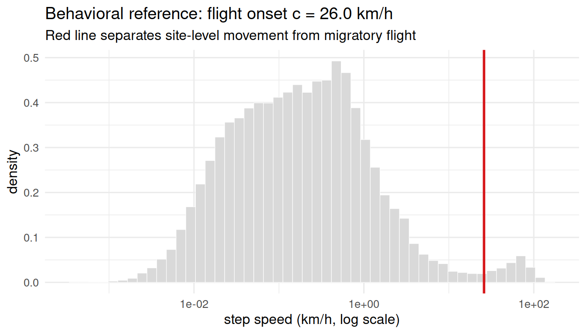
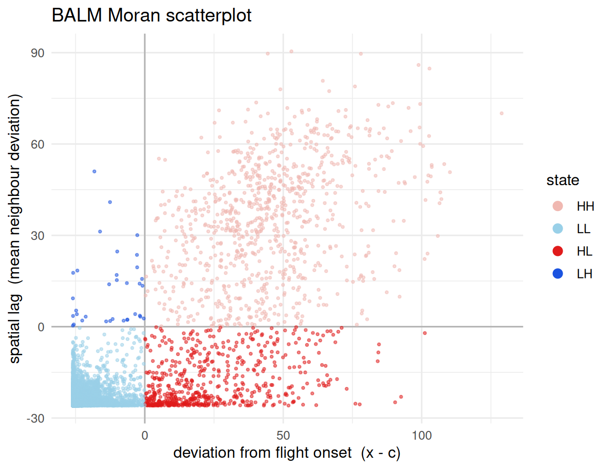
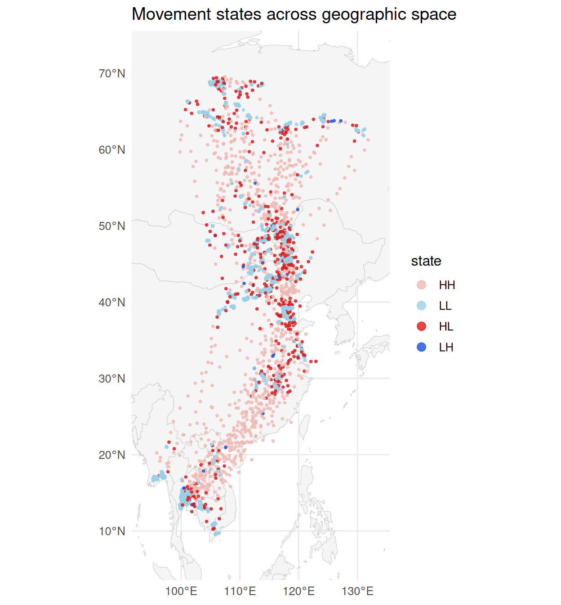

# Movement-State Segmentation with BALM

## Overview

[`balm_segmentation()`](https://evertsz.github.io/movepp/reference/balm_segmentation.md)
classifies each tracking fix into a movement state using **BALM**
(Behaviorally-Anchored Local Moran), a movement-adapted variant of the
Local Moran scatterplot. It uses only point locations and a
movement-rate mark – never direction or the raw temporal sequence – so
it is invariant to fix ordering and robust to sampling-rate
heterogeneity.

Each fix is labelled by the signs of its deviation from a behavioral
reference `c` (the migratory-flight onset) and its spatial lag:

- **HH** – fast fix among fast neighbours -\> active migration
- **LL** – slow fix among slow neighbours -\> stationary site
- **HL** – fast fix among slow neighbours -\> local movement within a
  site (commuting / foraging burst)
- **LH** – slow fix among fast neighbours -\> brief touch-down in the
  migratory corridor (transient stopover)

Two choices distinguish BALM from the textbook Local Moran: the high/low
reference is a **data-driven behavioral threshold** (the flight-onset
speed) rather than the arithmetic mean, and classification is
**deterministic** (no permutation significance) – spatial support is
arbitrated downstream by density clustering
([`dbscan_habitats()`](https://evertsz.github.io/movepp/reference/dbscan_habitats.md)).

## Setup

``` r

library(movepp)
library(sf)
#> Linking to GEOS 3.12.1, GDAL 3.8.4, PROJ 9.4.0; sf_use_s2() is TRUE
library(ggplot2)
data(godwit_demo)
```

## Movement rate

``` r

godwit <- compute_step_speed(godwit_demo,
                             time_col       = "time",
                             individual_col = "individual",
                             direction      = "centered")
```

## Segmentation

``` r

seg <- balm_segmentation(godwit,
                         variable_col   = "step_speed",
                         individual_col = "individual",
                         verbose        = FALSE)
table(seg$cluster_type, useNA = "ifany")
#> 
#>    HH    LL    HL    LH 
#>   878 59894   604    34
attr(seg, "balm_reference")   # flight-onset reference c (km/h)
#> Black-tailed Godwit 23_02 Black-tailed Godwit 23_03 Black-tailed Godwit 23_05 
#>                  25.95689                  25.95689                  25.95689 
#> Black-tailed Godwit 23_06 Black-tailed Godwit 23_07 Black-tailed Godwit 23_08 
#>                  25.95689                  25.95689                  25.95689 
#> Black-tailed Godwit 23_11 Black-tailed Godwit 23_16 Black-tailed Godwit 23_21 
#>                  25.95689                  25.95689                  25.95689 
#> Black-tailed Godwit 23_22 
#>                  25.95689
```

## Where the high/low reference comes from

The reference `c` is the **flight-onset speed** – detected as the left
foot of the right-most peak of the (log) step-speed density, i.e. the
boundary between site-level movement and migratory flight.

``` r

ref <- attr(seg, "balm_reference")[[1]]
spd <- godwit$step_speed[is.finite(godwit$step_speed) & godwit$step_speed > 0]

ggplot(data.frame(spd = spd), aes(spd)) +
  geom_histogram(aes(y = after_stat(density)), bins = 50,
                 fill = "grey85", colour = "white", linewidth = 0.2) +
  geom_vline(xintercept = ref, colour = "#D7191C", linewidth = 1) +
  scale_x_log10() +
  labs(x = "step speed (km/h, log scale)", y = "density",
       title = sprintf("Behavioral reference: flight onset c = %.1f km/h", ref),
       subtitle = "Red line separates site-level movement from migratory flight") +
  theme_minimal(base_size = 12)
```



## The BALM Moran scatterplot

Each fix is placed by its own deviation `x - c` (x-axis) against the
mean deviation of its spatial neighbours (y-axis); the four quadrants
are the four movement states.

``` r

cluster_pal <- c(HH = "#F0B8B1", LL = "#99D0E8", HL = "#E01B1B", LH = "#1B53E0")

ggplot(sf::st_drop_geometry(seg),
       aes(balm_deviation, balm_lag, colour = cluster_type)) +
  geom_hline(yintercept = 0, colour = "grey70") +
  geom_vline(xintercept = 0, colour = "grey70") +
  geom_point(alpha = 0.5, size = 0.7) +
  scale_colour_manual(values = cluster_pal, name = "state", na.translate = FALSE) +
  guides(colour = guide_legend(override.aes = list(size = 3, alpha = 1))) +
  labs(x = "deviation from flight onset  (x - c)",
       y = "spatial lag  (mean neighbour deviation)",
       title = "BALM Moran scatterplot") +
  theme_minimal(base_size = 12)
```



## Spatial result

``` r

world <- rnaturalearth::ne_countries(scale = "medium", returnclass = "sf")
bb    <- sf::st_bbox(seg)
padx  <- as.numeric(bb["xmax"] - bb["xmin"]) * 0.10
pady  <- as.numeric(bb["ymax"] - bb["ymin"]) * 0.10

ggplot() +
  geom_sf(data = world, fill = "grey96", colour = "grey80", linewidth = 0.2) +
  geom_sf(data = seg, aes(colour = cluster_type), size = 0.7, alpha = 0.8) +
  scale_colour_manual(values = cluster_pal, name = "state", na.translate = FALSE) +
  coord_sf(xlim = c(bb["xmin"] - padx, bb["xmax"] + padx),
           ylim = c(bb["ymin"] - pady, bb["ymax"] + pady), expand = FALSE) +
  guides(colour = guide_legend(override.aes = list(size = 3))) +
  labs(title = "Movement states across geographic space") +
  theme_minimal(base_size = 12)
```



## Stationary subset for downstream analysis

The `LL` (stationary cores) and `LH` (transient stopovers) fixes are the
input to spatial habitat delineation:

``` r

stationary <- seg[!is.na(seg$cluster_type) &
                  seg$cluster_type %in% c("LL", "LH"), ]
nrow(stationary)
#> [1] 59928
```

## Discussion

BALM asks “is this fix part of a spatial cluster of high (or low)
movement rate”, using spatial structure alone. The behavioral signature
of migration – fast, transient passage – manifests spatially as
high-rate fixes in sparse corridors (`HH`), whereas fast movements
confined to a site appear as `HL` outliers; no explicit measure of
direction is required.

## See also

- `vignette("v01-data-overview")` – full workflow
- `vignette("v03-dbscan-habitats")` – downstream clustering of LL/LH
  points

## Session info

``` r

sessionInfo()
#> R version 4.6.0 (2026-04-24)
#> Platform: x86_64-pc-linux-gnu
#> Running under: Ubuntu 24.04.4 LTS
#> 
#> Matrix products: default
#> BLAS:   /usr/lib/x86_64-linux-gnu/openblas-pthread/libblas.so.3 
#> LAPACK: /usr/lib/x86_64-linux-gnu/openblas-pthread/libopenblasp-r0.3.26.so;  LAPACK version 3.12.0
#> 
#> locale:
#>  [1] LC_CTYPE=C.UTF-8       LC_NUMERIC=C           LC_TIME=C.UTF-8       
#>  [4] LC_COLLATE=C.UTF-8     LC_MONETARY=C.UTF-8    LC_MESSAGES=C.UTF-8   
#>  [7] LC_PAPER=C.UTF-8       LC_NAME=C              LC_ADDRESS=C          
#> [10] LC_TELEPHONE=C         LC_MEASUREMENT=C.UTF-8 LC_IDENTIFICATION=C   
#> 
#> time zone: UTC
#> tzcode source: system (glibc)
#> 
#> attached base packages:
#> [1] stats     graphics  grDevices utils     datasets  methods   base     
#> 
#> other attached packages:
#> [1] ggplot2_4.0.3 sf_1.1-1      movepp_0.1.4 
#> 
#> loaded via a namespace (and not attached):
#>  [1] gtable_0.3.6            jsonlite_2.0.0          dplyr_1.2.1            
#>  [4] compiler_4.6.0          tidyselect_1.2.1        Rcpp_1.1.1-1.1         
#>  [7] scales_1.4.0            yaml_2.3.12             fastmap_1.2.0          
#> [10] dbscan_1.2.5            R6_2.6.1                labeling_0.4.3         
#> [13] generics_0.1.4          classInt_0.4-11         s2_1.1.11              
#> [16] knitr_1.51              tibble_3.3.1            units_1.0-1            
#> [19] DBI_1.3.0               pillar_1.11.1           RColorBrewer_1.1-3     
#> [22] rlang_1.2.0             xfun_0.58               S7_0.2.2               
#> [25] rnaturalearth_1.2.0     otel_0.2.0              cli_3.6.6              
#> [28] withr_3.0.2             magrittr_2.0.5          wk_0.9.5               
#> [31] class_7.3-23            digest_0.6.39           grid_4.6.0             
#> [34] mclust_6.1.2            lifecycle_1.0.5         vctrs_0.7.3            
#> [37] KernSmooth_2.23-26      proxy_0.4-29            evaluate_1.0.5         
#> [40] glue_1.8.1              farver_2.1.2            rnaturalearthdata_1.0.0
#> [43] e1071_1.7-17            rmarkdown_2.31          tools_4.6.0            
#> [46] pkgconfig_2.0.3         htmltools_0.5.9
```
