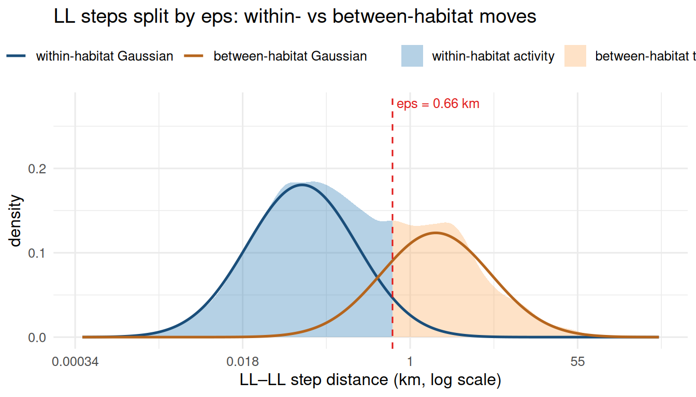
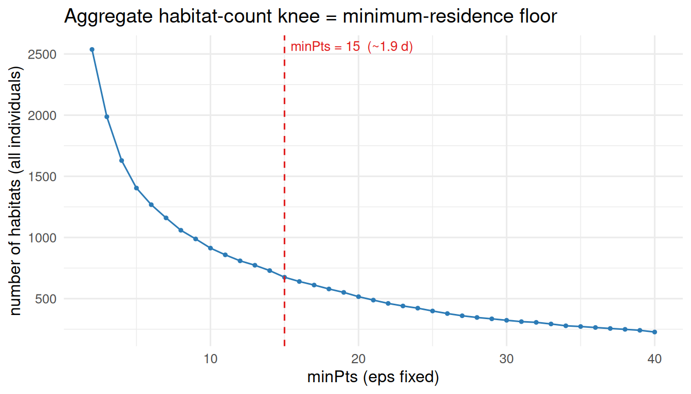
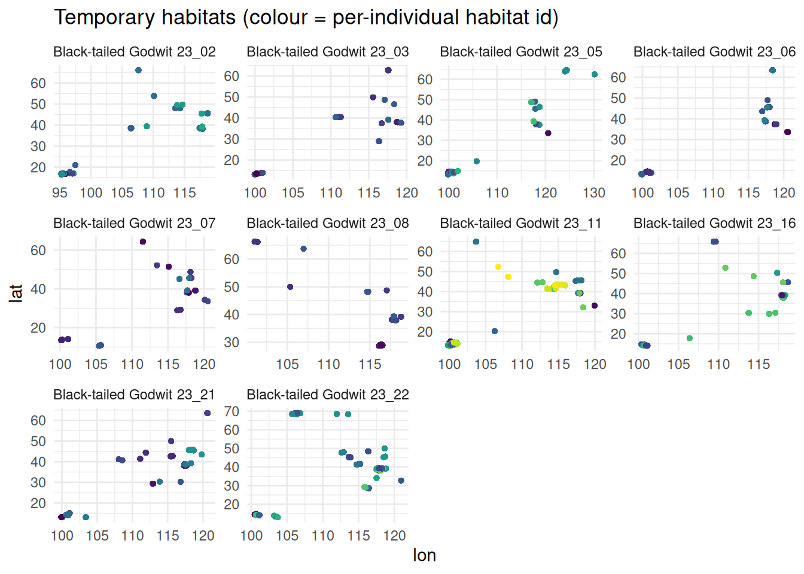

# DBSCAN Temporary Habitat Delineation

## Overview

[`dbscan_habitats()`](https://EverTSZ.github.io/movepp/reference/dbscan_habitats.md)
clusters the low-speed points (LL stationary cores plus LH
short-stopover arrivals) from
[`balm_segmentation()`](https://EverTSZ.github.io/movepp/reference/balm_segmentation.md)
into spatially-bounded **temporary habitats**, using standard DBSCAN
(Ester et al. 1996) per individual. Its two parameters are **derived
from the data** by
[`detect_habitat_params()`](https://EverTSZ.github.io/movepp/reference/detect_habitat_params.md),
not hard-coded, and each has an explicit behavioural meaning:

- `eps` – the **within-site movement radius**. On the segmented track,
  the consecutive steps whose *both* endpoints are stationary (BALM
  “LL”) are the genuine within-site moves; pooled across individuals and
  fit with a log-Gaussian mixture, they split at the largest mean-gap
  into a within-site complex and higher relocation modes. `eps` is the
  95th percentile of the within-site complex.
- `minPts` – the **minimum-residence floor**: the knee of the aggregate
  habitat-count vs `minPts` curve at `eps`. Its meaning is temporal –
  `minPts x sampling-interval` = minimum residence duration (reported),
  or set it directly with `min_residence` (days).

[`detect_habitat_params()`](https://EverTSZ.github.io/movepp/reference/detect_habitat_params.md)
also reports the `regime` (“migratory” when flight (HH) steps exist,
else “continuous”) and `gap_ratio`, the fold-separation between the
flight and within-site scales.

## Setup

``` r

library(movepp)
library(sf)
library(ggplot2)

g <- compute_step_speed(godwit_demo, time_col = "time",
                        individual_col = "individual", direction = "centered")
seg <- balm_segmentation(g, variable_col = "step_speed",
                         individual_col = "individual", verbose = FALSE)
stationary <- seg[!is.na(seg$cluster_type) &
                  seg$cluster_type %in% c("LL", "LH"), ]

# NOTE: `track` is the *segmented* trajectory (carries cluster_type), not raw g
p <- detect_habitat_params(stationary, track = seg,
                           individual_col = "individual", time_col = "time")
unlist(p[c("eps", "minPts", "regime", "gap_ratio",
           "n_components", "sampling_interval_h", "min_residence_days")])
#>                 eps              minPts              regime           gap_ratio 
#> "0.656127455608507"                "15"         "migratory"  "305.806950392131" 
#>        n_components sampling_interval_h  min_residence_days 
#>                 "2"                 "3"             "1.875"
```

## 1. Choosing `eps`: within-habitat activity vs between-habitat transfer

`eps` is the within-site movement scale, derived from the LL
(“stationary”) steps alone. The HH (flight) steps represent the
**migratory** state — large- scale relocations between the wintering and
breeding ranges — and belong to the macro scale, not to habitat
delineation, so they are excluded here.

The LL fixes are not a single behaviour. While the bird is on its
wintering or breeding grounds, the LL–LL steps mix two states:
**within-habitat activity** (resting, foraging, short local transits — a
small spatial scale) and **between-habitat transfer** (moves from one
temporary habitat to another — a larger scale). Pooled across
individuals and fit with a log-Gaussian mixture, these split at the
largest mean-gap; `eps` is the 95th percentile of the lower,
within-habitat complex — exactly the radius that separates
within-habitat activity from between-habitat transfer.

The figure overlays the **fitted log-Gaussian mixture** (refit here with
the same `set.seed(1)` / `mclust::Mclust(G = 1:5)` call the function
uses) on the empirical LL–LL distribution. The dark-blue curve is the
within-habitat component(s); `eps` is its 95th percentile, marked by the
dashed line.

``` r

gx <- function(co) {
  n <- nrow(co); if (n < 2) return(numeric(0)); rr <- pi / 180
  a <- sin(diff(co[, 2]) * rr / 2)^2 +
       cos(co[-n, 2] * rr) * cos(co[-1, 2] * rr) * sin(diff(co[, 1]) * rr / 2)^2
  6371 * 2 * asin(pmin(1, sqrt(a)))
}
ll_steps <- unlist(lapply(unique(seg$individual), function(id) {
  s <- seg[seg$individual == id, ]; s <- s[order(s$time), ]
  st <- as.character(s$cluster_type); d <- gx(st_coordinates(s))
  if (!length(d)) return(numeric(0))
  keep <- st[-length(st)] == "LL" & st[-1] == "LL"   # both endpoints stationary
  d[keep & d > 0]
}))

# Empirical LL–LL density (natural-log scale, matching the eps derivation),
# split at eps: within-habitat (<= eps) vs between-habitat (> eps)
lv <- log(ll_steps)
dn <- stats::density(lv)
xb <- log(p$eps); yb <- stats::approx(dn$x, dn$y, xout = xb)$y
dd <- rbind(
  data.frame(x = c(dn$x[dn$x <= xb], xb), y = c(dn$y[dn$x <= xb], yb),
             region = "within-habitat activity"),
  data.frame(x = c(xb, dn$x[dn$x > xb]), y = c(yb, dn$y[dn$x > xb]),
             region = "between-habitat transfer"))
dd$region <- factor(dd$region,
                    levels = c("within-habitat activity", "between-habitat transfer"))

# Refit the same GMM used to derive eps, and split at the largest mean-gap
mclustBIC <- mclust::mclustBIC          # mclust requires this in scope
set.seed(1L)
fit <- mclust::Mclust(sort(lv), G = 1:5, verbose = FALSE)
mu  <- fit$parameters$mean
v   <- fit$parameters$variance$sigmasq; if (length(v) == 1L) v <- rep(v, fit$G)
w   <- fit$parameters$pro
om  <- order(mu); mu <- mu[om]; v <- v[om]; w <- w[om]
cut <- if (fit$G > 1L) which.max(diff(mu)) else 1L
loc <- seq_len(cut); rel <- if (cut < fit$G) (cut + 1L):fit$G else integer(0)
mix <- function(idx) if (!length(idx)) rep(0, length(dn$x)) else
  Reduce(`+`, lapply(idx, function(i) w[i] * stats::dnorm(dn$x, mu[i], sqrt(v[i]))))
gmm <- rbind(
  data.frame(x = dn$x, dens = mix(loc), component = "within-habitat Gaussian"),
  data.frame(x = dn$x, dens = mix(rel), component = "between-habitat Gaussian"))
gmm <- gmm[!(gmm$component == "between-habitat Gaussian" & !length(rel)), ]
gmm$component <- factor(gmm$component,
                        levels = c("within-habitat Gaussian", "between-habitat Gaussian"))

ggplot() +
  geom_area(data = dd, aes(x, y, fill = region), alpha = 0.35) +
  geom_line(data = gmm, aes(x, dens, colour = component), linewidth = 0.9) +
  geom_vline(xintercept = xb, colour = "#E01B1B", linetype = "dashed") +
  annotate("text", x = xb, y = Inf, hjust = -0.05, vjust = 1.6, size = 3.4,
           colour = "#E01B1B", label = sprintf("eps = %.2f km", p$eps)) +
  scale_x_continuous(labels = function(v) signif(exp(v), 2)) +
  scale_fill_manual(values = c("within-habitat activity"  = "#2C7BB6",
                               "between-habitat transfer" = "#FDAE61")) +
  scale_colour_manual(values = c("within-habitat Gaussian"  = "#1A4E7A",
                                 "between-habitat Gaussian" = "#B5651D")) +
  labs(x = "LL–LL step distance (km, log scale)", y = "density",
       fill = NULL, colour = NULL,
       title = "LL steps split by eps: within- vs between-habitat moves") +
  theme_minimal(base_size = 12) + theme(legend.position = "top")
```



## 2. Choosing `minPts`: the habitat-count knee

At the chosen `eps`, the total number of habitats (summed across
individuals) falls as `minPts` rises. The **knee** – where culling
spurious small clusters gives way to eroding real habitats – sets the
minimum-residence floor. Its meaning is temporal:
`minPts x sampling-interval` days of residence. Supply `min_residence`
(days) to set this floor behaviourally instead.

``` r

ids <- unique(stationary$individual); rr <- pi / 180
mg  <- 2:40
agg <- vapply(mg, function(m) sum(vapply(ids, function(id) {
  co <- st_coordinates(stationary[stationary$individual == id, ])
  if (nrow(co) < m) return(0L)
  latm <- mean(co[, 2])
  xy   <- cbind(co[, 1] * cos(latm * rr) * 111.320, co[, 2] * 111.320)
  length(unique({cl <- dbscan::dbscan(xy, eps = p$eps, minPts = m)$cluster; cl[cl > 0]}))
}, integer(1))), integer(1))

ggplot(data.frame(mg, agg), aes(mg, agg)) +
  geom_line(colour = "#2C7BB6") + geom_point(size = 0.9, colour = "#2C7BB6") +
  geom_vline(xintercept = p$minPts, colour = "#E01B1B", linetype = "dashed") +
  annotate("text", x = p$minPts, y = Inf, hjust = -0.05, vjust = 1.6, size = 3.4,
           colour = "#E01B1B",
           label = sprintf("minPts = %d  (~%.1f d)", p$minPts, p$min_residence_days)) +
  labs(x = "minPts (eps fixed)", y = "number of habitats (all individuals)",
       title = "Aggregate habitat-count knee = minimum-residence floor") +
  theme_minimal(base_size = 12)
```



## 3. Delineated temporary habitats

``` r

hab <- dbscan_habitats(stationary, individual_col = "individual",
                       eps = p$eps, minPts = p$minPts)
tapply(hab$cluster_id, hab$individual, function(z) length(unique(z)))
#> Black-tailed Godwit 23_02 Black-tailed Godwit 23_03 Black-tailed Godwit 23_05 
#>                        70                        39                        82 
#> Black-tailed Godwit 23_06 Black-tailed Godwit 23_07 Black-tailed Godwit 23_08 
#>                        50                        43                        33 
#> Black-tailed Godwit 23_11 Black-tailed Godwit 23_16 Black-tailed Godwit 23_21 
#>                       115                        90                        63 
#> Black-tailed Godwit 23_22 
#>                        90
```

``` r

hc <- st_coordinates(hab)
hd <- data.frame(lon = hc[, 1], lat = hc[, 2],
                 habitat = factor(hab$cluster_id), individual = hab$individual)
ggplot(hd, aes(lon, lat, colour = habitat)) +
  geom_point(size = 1, alpha = 0.8, show.legend = FALSE) +
  facet_wrap(~ individual, scales = "free") +
  scale_colour_viridis_d() +
  labs(x = "lon", y = "lat",
       title = "Temporary habitats (colour = per-individual habitat id)") +
  theme_minimal(base_size = 11)
```



`hab` is the stationary subset with an added integer `cluster_id`; noise
is dropped by default. Downstream steps
([`compute_mpi()`](https://EverTSZ.github.io/movepp/reference/compute_mpi.md),
[`classify_phases()`](https://EverTSZ.github.io/movepp/reference/classify_phases.md))
consume `hab$cluster_id` unchanged.

## Reference

Ester, M., Kriegel, H.-P., Sander, J., & Xu, X. (1996). A density-based
algorithm for discovering clusters in large spatial databases with
noise. *Proc. KDD-96*, 226-231.
