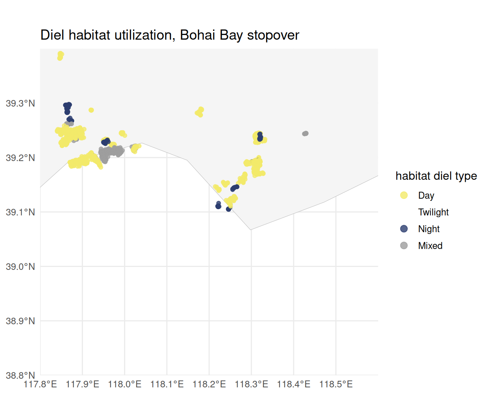
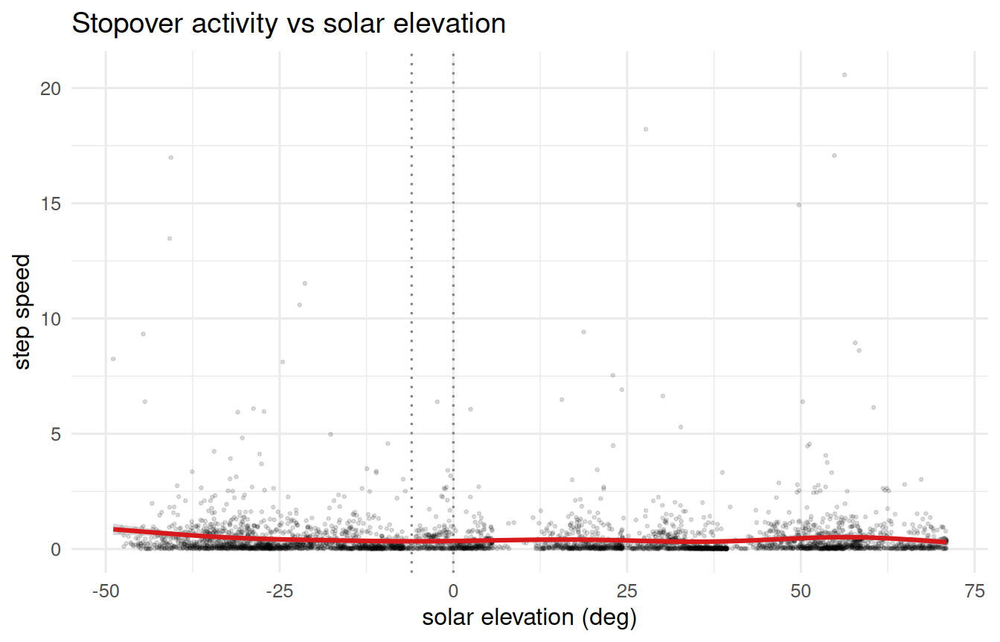
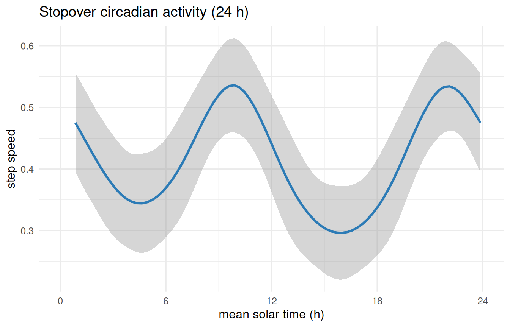

# Solar-Elevation Circadian Classification

## Overview

[`compute_solar_elevation()`](https://EverTSZ.github.io/movepp/reference/compute_solar_elevation.md)
and
[`classify_circadian()`](https://EverTSZ.github.io/movepp/reference/classify_circadian.md)
partition tracking fixes by **solar elevation angle** into day /
twilight / night. This vignette goes one step further than a per-fix
label: it asks **how each temporary habitat is used over the diel
cycle**, by voting the fixes within every habitat into a single *diel
type* (Day / Twilight / Night, or Mixed when no period exceeds 50%).

We demonstrate this on the **stopover** habitats of the godwit’s
spring/autumn passage through the **Bohai Bay** region (Yellow Sea), one
of the most important refuelling areas on the East Asian–Australasian
Flyway. Restricting to a single staging region keeps the diel-use map
legible and shows how roosting (night) and foraging (day) sites separate
spatially within one stopover.

## Setup

We first rebuild the meso-scale phase classification exactly as in
`vignette("v04-mpi-phases")`, then keep the **Stopover** fixes inside
the Bohai Bay bounding box.

``` r

library(movepp)
library(sf)
#> Linking to GEOS 3.12.1, GDAL 3.8.4, PROJ 9.4.0; sf_use_s2() is TRUE
library(ggplot2)
data("godwit_demo")

godwit <- compute_step_speed(godwit_demo, time_col = "time",
                             individual_col = "individual", direction = "centered")
seg <- balm_segmentation(godwit, variable_col = "step_speed",
                         individual_col = "individual", verbose = FALSE)
stationary <- seg[!is.na(seg$cluster_type) & seg$cluster_type %in% c("LL", "LH"), ]
p   <- detect_habitat_params(stationary, track = seg,
                             individual_col = "individual", time_col = "time")
#> eps    = 0.656 km  (migratory; 0.95-quantile of 2-comp GMM; flight/eps gap 306x)
#> minPts = 15  (~1.88 d min residence at 3.0 h sampling; knee)
hab <- dbscan_habitats(stationary, individual_col = "individual",
                       eps = p$eps, minPts = p$minPts)
mpi <- compute_mpi(hab, individual_col = "individual",
                   time_col = "time", verbose = FALSE)
phs <- classify_phases(mpi, n_phases = 3, individual_col = "individual")
#> [classify_phases] 3 phase(s); peaks {0.035, 0.635, 0.964}; cut(s) {0.220, 0.846}; sizes {19963, 18973, 8016}; mean MPI {0.042, 0.615, 0.960}
```

Restrict to the **Stopover** phase within the Bohai Bay box (117.8–118.6
°E, 38.8–39.4 °N):

``` r

co <- sf::st_coordinates(phs); phs$lon <- co[, 1]; phs$lat <- co[, 2]
bohai <- phs[!is.na(phs$phase) & phs$phase == "Stopover" &
             phs$lon >= 117.8 & phs$lon <= 118.6 &
             phs$lat >=  38.8 & phs$lat <=  39.4, ]
c(stopover_fixes = nrow(bohai),
  habitats       = length(unique(bohai$cluster_id)))
#> stopover_fixes       habitats 
#>           3763             33
```

## Compute solar elevation and classify the diel period

``` r

bohai <- compute_solar_elevation(bohai, time_col = "time")
#> [compute_solar_elevation] Computing for 3763 points...
#> [compute_solar_elevation] Done. Range: -48.9 to 71.0 deg
bohai <- classify_circadian(bohai, verbose = FALSE)
table(bohai$circadian, useNA = "ifany")
#> 
#>      Day Twilight    Night 
#>     2108      174     1481
```

Defaults follow the standard civil-twilight definition:

- **Day**: elevation \> 0 deg
- **Twilight**: -6 \< elevation \<= 0 deg
- **Night**: elevation \<= -6 deg

Override via `day_threshold` / `twilight_threshold` for a stricter cut
(e.g. astronomical twilight at -18 deg).

## Diel typing of each habitat

Each temporary habitat is classified by the **majority diel period** of
its fixes: the dominant period wins if it holds \>50% of the fixes,
otherwise the habitat is labelled **Mixed**.

``` r

bohai <- classify_habitat_circadian(bohai, individual_col = "individual",
                                     cluster_col = "cluster_id", verbose = FALSE)
table(bohai$habitat_circadian, useNA = "ifany")
#> 
#>      Day Twilight    Night    Mixed 
#>     3156        0      204      403
```

A one-row-per-habitat summary of the diel split and resulting type:

``` r

hab_tab <- attr(bohai, "habitat_circadian")
hab_tab <- hab_tab[order(hab_tab$type, -hab_tab$n), ]
print(hab_tab, row.names = FALSE)
#>                 individual cluster_id   n prop_Day prop_Twilight prop_Night
#>  Black-tailed Godwit 23_16         27 671    0.526         0.042      0.432
#>  Black-tailed Godwit 23_22         65 416    0.613         0.007      0.380
#>  Black-tailed Godwit 23_16          2 351    0.632         0.060      0.308
#>  Black-tailed Godwit 23_22         31 338    0.592         0.044      0.364
#>  Black-tailed Godwit 23_22         22 334    0.584         0.030      0.386
#>  Black-tailed Godwit 23_16          3 147    0.524         0.109      0.367
#>  Black-tailed Godwit 23_16         61 113    0.504         0.000      0.496
#>  Black-tailed Godwit 23_16          1 111    0.523         0.000      0.477
#>  Black-tailed Godwit 23_08         15 108    0.546         0.046      0.407
#>  Black-tailed Godwit 23_22         90  79    0.924         0.013      0.063
#>  Black-tailed Godwit 23_08         20  62    0.613         0.000      0.387
#>  Black-tailed Godwit 23_02         70  57    0.509         0.140      0.351
#>  Black-tailed Godwit 23_21         49  55    0.618         0.000      0.382
#>  Black-tailed Godwit 23_16         62  44    0.614         0.023      0.364
#>  Black-tailed Godwit 23_21         63  39    0.846         0.000      0.154
#>  Black-tailed Godwit 23_16         34  33    0.606         0.000      0.394
#>  Black-tailed Godwit 23_16         86  27    0.667         0.000      0.333
#>  Black-tailed Godwit 23_16         60  23    0.522         0.000      0.478
#>  Black-tailed Godwit 23_22         64  23    0.565         0.000      0.435
#>  Black-tailed Godwit 23_21         62  21    0.571         0.000      0.429
#>  Black-tailed Godwit 23_22         41  21    0.619         0.000      0.381
#>  Black-tailed Godwit 23_16         35  19    0.579         0.000      0.421
#>  Black-tailed Godwit 23_02         68  17    0.647         0.353      0.000
#>  Black-tailed Godwit 23_08         33  16    0.562         0.062      0.375
#>  Black-tailed Godwit 23_11         52  16    0.688         0.000      0.312
#>  Black-tailed Godwit 23_02         69  15    0.533         0.000      0.467
#>  Black-tailed Godwit 23_11          1 169    0.426         0.095      0.479
#>  Black-tailed Godwit 23_11          2  73    0.493         0.301      0.205
#>  Black-tailed Godwit 23_16          4  61    0.393         0.115      0.492
#>  Black-tailed Godwit 23_11         88  32    0.406         0.094      0.500
#>  Black-tailed Godwit 23_11          3  20    0.450         0.200      0.350
#>  Black-tailed Godwit 23_22         89  17    0.471         0.118      0.412
#>  Black-tailed Godwit 23_11         50  16    0.500         0.000      0.500
#>  Black-tailed Godwit 23_11         89  15    0.467         0.133      0.400
#>  Black-tailed Godwit 23_16         59  68    0.485         0.000      0.515
#>  Black-tailed Godwit 23_21         50  28    0.429         0.000      0.571
#>  Black-tailed Godwit 23_16         90  20    0.400         0.000      0.600
#>  Black-tailed Godwit 23_22         19  20    0.350         0.100      0.550
#>  Black-tailed Godwit 23_22         21  19    0.316         0.000      0.684
#>  Black-tailed Godwit 23_16         63  18    0.389         0.000      0.611
#>  Black-tailed Godwit 23_16         66  16    0.312         0.000      0.688
#>  Black-tailed Godwit 23_22         20  15    0.333         0.067      0.600
#>   type
#>    Day
#>    Day
#>    Day
#>    Day
#>    Day
#>    Day
#>    Day
#>    Day
#>    Day
#>    Day
#>    Day
#>    Day
#>    Day
#>    Day
#>    Day
#>    Day
#>    Day
#>    Day
#>    Day
#>    Day
#>    Day
#>    Day
#>    Day
#>    Day
#>    Day
#>    Day
#>  Mixed
#>  Mixed
#>  Mixed
#>  Mixed
#>  Mixed
#>  Mixed
#>  Mixed
#>  Mixed
#>  Night
#>  Night
#>  Night
#>  Night
#>  Night
#>  Night
#>  Night
#>  Night
```

## Map: diel habitat utilization in Bohai Bay

Each fix is coloured by the diel type of the habitat it belongs to, over
the Bohai Bay coastline. Night-typed (roosting) and day-typed (foraging)
habitats occupy distinct locations within the single stopover region.

``` r

world    <- rnaturalearth::ne_countries(scale = "medium", returnclass = "sf")
type_pal <- c(Night = "#2C3E70", Twilight = "#E9A23B",
              Day = "#F2E96B", Mixed = "#9E9E9E")

ggplot() +
  geom_sf(data = world, fill = "grey96", colour = "grey75", linewidth = 0.2) +
  geom_sf(data = bohai, aes(colour = habitat_circadian), size = 1.6, alpha = 0.8) +
  scale_colour_manual(values = type_pal, name = "habitat diel type",
                      drop = FALSE, na.translate = FALSE) +
  coord_sf(xlim = c(117.8, 118.6), ylim = c(38.8, 39.4), expand = FALSE) +
  guides(colour = guide_legend(override.aes = list(size = 3))) +
  labs(x = NULL, y = NULL,
       title = "Diel habitat utilization, Bohai Bay stopover") +
  theme_minimal(base_size = 12)
```



Diel utilization of stopover habitats in Bohai Bay: each habitat typed
by its dominant solar period.

## Activity across the diel cycle

Step speed against solar elevation shows when the bird is active; the
dotted lines mark the twilight (-6 deg) and day (0 deg) thresholds.

``` r

ggplot(bohai, aes(solar_elevation, step_speed)) +
  geom_point(alpha = 0.12, size = 0.5) +
  geom_smooth(method = "gam", formula = y ~ s(x), colour = "#D7191C") +
  geom_vline(xintercept = c(-6, 0), linetype = "dotted", colour = "grey50") +
  labs(x = "solar elevation (deg)", y = "step speed",
       title = "Stopover activity vs solar elevation") +
  theme_minimal(base_size = 12)
```



A 24-hour rhythm in **mean solar time** (UTC hour + lon / 15), with a
cyclic spline so the curve joins at 0/24 h:

``` r

utc <- as.POSIXct(format(bohai$time, tz = "UTC"), tz = "UTC")
bohai$solar_hour <- ((as.numeric(format(utc, "%H")) +
                      as.numeric(format(utc, "%M")) / 60) + bohai$lon / 15) %% 24
ggplot(bohai, aes(solar_hour, step_speed)) +
  geom_smooth(method = "gam", formula = y ~ s(x, bs = "cc"), colour = "#2C7BB6") +
  scale_x_continuous(breaks = seq(0, 24, 6), limits = c(0, 24)) +
  labs(x = "mean solar time (h)", y = "step speed",
       title = "Stopover circadian activity (24 h)") +
  theme_minimal(base_size = 12)
```



## See also

- `vignette("v04-mpi-phases")` — the upstream phase classification
- `vignette("v06-isfi")` — stratifying site fidelity by phase

``` r

sessionInfo()
#> R version 4.6.0 (2026-04-24)
#> Platform: x86_64-pc-linux-gnu
#> Running under: Ubuntu 24.04.4 LTS
#> 
#> Matrix products: default
#> BLAS:   /usr/lib/x86_64-linux-gnu/openblas-pthread/libblas.so.3 
#> LAPACK: /usr/lib/x86_64-linux-gnu/openblas-pthread/libopenblasp-r0.3.26.so;  LAPACK version 3.12.0
#> 
#> locale:
#>  [1] LC_CTYPE=C.UTF-8       LC_NUMERIC=C           LC_TIME=C.UTF-8       
#>  [4] LC_COLLATE=C.UTF-8     LC_MONETARY=C.UTF-8    LC_MESSAGES=C.UTF-8   
#>  [7] LC_PAPER=C.UTF-8       LC_NAME=C              LC_ADDRESS=C          
#> [10] LC_TELEPHONE=C         LC_MEASUREMENT=C.UTF-8 LC_IDENTIFICATION=C   
#> 
#> time zone: UTC
#> tzcode source: system (glibc)
#> 
#> attached base packages:
#> [1] stats     graphics  grDevices utils     datasets  methods   base     
#> 
#> other attached packages:
#> [1] ggplot2_4.0.3 sf_1.1-1      movepp_0.1.4 
#> 
#> loaded via a namespace (and not attached):
#>  [1] s2_1.1.11               generics_0.1.4          class_7.3-23           
#>  [4] KernSmooth_2.23-26      lattice_0.22-9          digest_0.6.39          
#>  [7] magrittr_2.0.5          evaluate_1.0.5          grid_4.6.0             
#> [10] timechange_0.4.0        RColorBrewer_1.1-3      rnaturalearth_1.2.0    
#> [13] fastmap_1.2.0           Matrix_1.7-5            jsonlite_2.0.0         
#> [16] e1071_1.7-17            DBI_1.3.0               mclust_6.1.2           
#> [19] mgcv_1.9-4              scales_1.4.0            cli_3.6.6              
#> [22] rlang_1.2.0             units_1.0-1             splines_4.6.0          
#> [25] withr_3.0.2             yaml_2.3.12             otel_0.2.0             
#> [28] tools_4.6.0             dplyr_1.2.1             vctrs_0.7.3            
#> [31] R6_2.6.1                proxy_0.4-29            lifecycle_1.0.5        
#> [34] lubridate_1.9.5         classInt_0.4-11         dbscan_1.2.5           
#> [37] pkgconfig_2.0.3         pillar_1.11.1           gtable_0.3.6           
#> [40] glue_1.8.1              data.table_1.18.4       Rcpp_1.1.1-1.1         
#> [43] rnaturalearthdata_1.0.0 xfun_0.58               tibble_3.3.1           
#> [46] tidyselect_1.2.1        knitr_1.51              farver_2.1.2           
#> [49] nlme_3.1-169            htmltools_0.5.9         labeling_0.4.3         
#> [52] rmarkdown_2.31          suncalc_0.5.1           wk_0.9.5               
#> [55] compiler_4.6.0          S7_0.2.2
```
