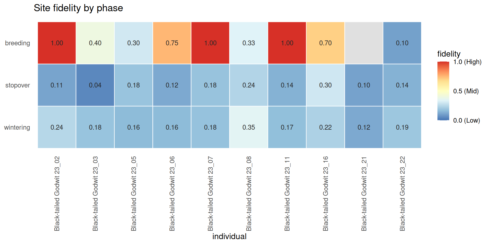

# Inter-Annual Site Fidelity (ISFI)

## Overview

[`compute_isfi()`](https://EverTSZ.github.io/movepp/reference/compute_isfi.md)
quantifies how often an individual returns to the same temporary habitat
(or nest) across years:

``` math
\text{ISFI} = \frac{\sum_i n_{i,\text{years}} - n}{(c - 1) \cdot n}
```

where `n` is unique clusters, `c` is unique years, and `n_{i,years}` is
the number of years cluster `i` was visited. ISFI ranges from 0 (no
fidelity) to 1 (every cluster revisited every year).

A single overall ISFI averaged across an entire annual cycle is
biologically uninformative: a bird may be highly faithful to its
wintering grounds but choose different stopover sites each year. The
recommended workflow is therefore to **stratify ISFI by life- history
phase**, exposing where in the cycle fidelity is strongest.

## Setup

``` r

library(movepp)
library(sf)
#> Linking to GEOS 3.12.1, GDAL 3.8.4, PROJ 9.4.0; sf_use_s2() is TRUE
library(ggplot2)
```

## Build phase-labelled habitats

We feed `godwit_demo` through the full macro-meso pipeline (step-speed →
BALM segmentation → DBSCAN → MPI → density-valley phase classification)
to obtain a set of temporary habitats each labelled with a life-history
phase:

``` r

data("godwit_demo")

godwit <- compute_step_speed(godwit_demo,
                              time_col       = "time",
                              individual_col = "individual",
                              direction      = "centered")

seg <- balm_segmentation(godwit,
                          variable_col    = "step_speed",
                          individual_col  = "individual",
                          verbose         = FALSE)

stationary   <- seg[!is.na(seg$cluster_type) & seg$cluster_type %in% c("LL", "LH"), ]
p    <- detect_habitat_params(stationary, track = seg,
                              individual_col = "individual", time_col = "time")
#> eps    = 0.656 km  (migratory; 0.95-quantile of 2-comp GMM; flight/eps gap 306x)
#> minPts = 15  (~1.88 d min residence at 3.0 h sampling; knee)
hab  <- dbscan_habitats(stationary,
                        individual_col = "individual",
                        eps = p$eps, minPts = p$minPts)
mpi  <- compute_mpi(hab, individual_col = "individual",
                    time_col = "time", verbose = FALSE)
phs  <- classify_phases(mpi, n_phases = 3, individual_col = "individual")
#> [classify_phases] 3 phase(s); peaks {0.035, 0.635, 0.964}; cut(s) {0.220, 0.846}; sizes {19963, 18973, 8016}; mean MPI {0.042, 0.615, 0.960}
```

[`classify_phases()`](https://EverTSZ.github.io/movepp/reference/classify_phases.md)
returns phase labels ordered by ascending mean MPI. We remap these to
biologically meaningful names:

``` r

ph_df    <- sf::st_drop_geometry(phs)
ph_order <- names(sort(tapply(ph_df$mpi, ph_df$phase, mean, na.rm = TRUE)))
phase_map <- setNames(c("wintering", "stopover", "breeding"), ph_order)
phs$phase_named <- factor(phase_map[as.character(phs$phase)],
                          levels = c("wintering", "stopover", "breeding"))

table(phs$phase_named, useNA = "ifany")
#> 
#> wintering  stopover  breeding 
#>     19963     18971      8018
```

## Per-phase ISFI

[`compute_isfi()`](https://EverTSZ.github.io/movepp/reference/compute_isfi.md)
with `phase_col` returns one row per (individual, phase) combination —
exactly the breakdown needed for biological interpretation:

``` r

isfi_by_phase <- compute_isfi(phs,
                               time_col       = "time",
                               individual_col = "individual",
                               cluster_col    = "cluster_id",
                               phase_col      = "phase_named")
#> [compute_isfi] 'Black-tailed Godwit 23_21::breeding' has only 1 year(s); ISFI undefined.
#> [compute_isfi] Computed for 30 individual_phase(s).
print(isfi_by_phase)
#>                   individual     phase n_clusters n_years sum_cluster_years
#> 1  Black-tailed Godwit 23_22 wintering         33       4                52
#> 2  Black-tailed Godwit 23_22  stopover         47       3                60
#> 3  Black-tailed Godwit 23_22  breeding         10       2                11
#> 4  Black-tailed Godwit 23_08 wintering         13       3                22
#> 5  Black-tailed Godwit 23_08  stopover         17       2                21
#> 6  Black-tailed Godwit 23_08  breeding          3       2                 4
#> 7  Black-tailed Godwit 23_11  stopover         41       4                58
#> 8  Black-tailed Godwit 23_11 wintering         73       4               110
#> 9  Black-tailed Godwit 23_11  breeding          1       3                 3
#> 10 Black-tailed Godwit 23_03 wintering         11       3                15
#> 11 Black-tailed Godwit 23_03  stopover         23       2                24
#> 12 Black-tailed Godwit 23_03  breeding          5       2                 7
#> 13 Black-tailed Godwit 23_06  stopover         21       3                26
#> 14 Black-tailed Godwit 23_06 wintering         25       3                33
#> 15 Black-tailed Godwit 23_06  breeding          4       2                 7
#> 16 Black-tailed Godwit 23_21 wintering         21       3                26
#> 17 Black-tailed Godwit 23_21  stopover         39       2                43
#> 18 Black-tailed Godwit 23_21  breeding          3       1                NA
#> 19 Black-tailed Godwit 23_05  stopover         29       4                45
#> 20 Black-tailed Godwit 23_05 wintering         48       4                71
#> 21 Black-tailed Godwit 23_05  breeding          5       3                 8
#> 22 Black-tailed Godwit 23_16  stopover         27       4                51
#> 23 Black-tailed Godwit 23_16 wintering         58       4                97
#> 24 Black-tailed Godwit 23_16  breeding          5       3                12
#> 25 Black-tailed Godwit 23_07  stopover         25       3                34
#> 26 Black-tailed Godwit 23_07  breeding          1       3                 3
#> 27 Black-tailed Godwit 23_07 wintering         17       3                23
#> 28 Black-tailed Godwit 23_02  stopover         28       3                34
#> 29 Black-tailed Godwit 23_02 wintering         41       3                61
#> 30 Black-tailed Godwit 23_02  breeding          1       2                 2
#>          isfi
#> 1  0.19191919
#> 2  0.13829787
#> 3  0.10000000
#> 4  0.34615385
#> 5  0.23529412
#> 6  0.33333333
#> 7  0.13821138
#> 8  0.16894977
#> 9  1.00000000
#> 10 0.18181818
#> 11 0.04347826
#> 12 0.40000000
#> 13 0.11904762
#> 14 0.16000000
#> 15 0.75000000
#> 16 0.11904762
#> 17 0.10256410
#> 18         NA
#> 19 0.18390805
#> 20 0.15972222
#> 21 0.30000000
#> 22 0.29629630
#> 23 0.22413793
#> 24 0.70000000
#> 25 0.18000000
#> 26 1.00000000
#> 27 0.17647059
#> 28 0.10714286
#> 29 0.24390244
#> 30 1.00000000
```

## Fidelity heatmap

A compact way to read the per-phase fidelities is a heatmap: one column
per individual, one row per phase ordered **Breeding (top) → Stopover →
Wintering (bottom)**, so the breeding-ground fidelity sits at the top.
The demo carries a **single** individual, so the map is one column wide;
on the full nine-individual dataset each bird adds a column, making
between-individual differences immediately legible.

``` r

phase_order <- c("wintering", "stopover", "breeding")   # bottom -> top
hm <- isfi_by_phase
hm$phase      <- factor(hm$phase, levels = phase_order)
hm$individual <- factor(hm$individual)

ggplot(hm, aes(individual, phase, fill = isfi)) +
  geom_tile(colour = "white", linewidth = 0.4) +
  geom_text(aes(label = ifelse(is.na(isfi), "", sprintf("%.2f", isfi))),
            size = 3.4, colour = "grey15") +
  scale_fill_distiller(name = "fidelity", palette = "RdYlBu", direction = -1,
                       limits = c(0, 1), breaks = c(0, 0.5, 1),
                       labels = c("0.0 (Low)", "0.5 (Mid)", "1.0 (High)"),
                       na.value = "grey88") +
  labs(x = "individual", y = NULL,
       title = "Site fidelity by phase") +
  theme_minimal(base_size = 12) +
  theme(panel.grid = element_blank(),
        axis.text.x = element_text(angle = 90, vjust = 0.5, hjust = 1))
```



Inter-annual site fidelity by life-history phase. Warm = high fidelity,
cool = low.

## Interpretation

Black-tailed Godwits are long-distance migrants with strong site
fidelity. The expected pattern across phases:

- **Breeding** — highest ISFI; godwits return to the same nesting
  territory year after year.
- **Wintering** — usually high; the species is faithful to specific
  coastal mudflats and lagoons.
- **Stopover** — most variable; choice of refuelling sites depends on
  weather, food availability, and timing.

The numerical breakdown above quantifies these patterns for this
specific individual.

## INFI: nest-level fidelity

The same function applied to the output of
[`detect_nests()`](https://EverTSZ.github.io/movepp/reference/detect_nests.md)
yields the Individual Nest Fidelity Index:

``` r

nests <- detect_nests(breeding_pts,
                      time_col       = "time",
                      individual_col = "individual")$nests
infi  <- compute_isfi(nests,
                      time_col       = "start_time",
                      individual_col = "individual",
                      cluster_col    = "nest_id")
```

## See also

- [`vignette("v04-mpi-phases")`](https://EverTSZ.github.io/movepp/articles/v04-mpi-phases.md)
  — phase classification (upstream)
- [`vignette("v07-st-dbscan-nesting")`](https://EverTSZ.github.io/movepp/articles/v07-st-dbscan-nesting.md)
  — produces the input for INFI

``` r

sessionInfo()
#> R version 4.6.0 (2026-04-24)
#> Platform: x86_64-pc-linux-gnu
#> Running under: Ubuntu 24.04.4 LTS
#> 
#> Matrix products: default
#> BLAS:   /usr/lib/x86_64-linux-gnu/openblas-pthread/libblas.so.3 
#> LAPACK: /usr/lib/x86_64-linux-gnu/openblas-pthread/libopenblasp-r0.3.26.so;  LAPACK version 3.12.0
#> 
#> locale:
#>  [1] LC_CTYPE=C.UTF-8       LC_NUMERIC=C           LC_TIME=C.UTF-8       
#>  [4] LC_COLLATE=C.UTF-8     LC_MONETARY=C.UTF-8    LC_MESSAGES=C.UTF-8   
#>  [7] LC_PAPER=C.UTF-8       LC_NAME=C              LC_ADDRESS=C          
#> [10] LC_TELEPHONE=C         LC_MEASUREMENT=C.UTF-8 LC_IDENTIFICATION=C   
#> 
#> time zone: UTC
#> tzcode source: system (glibc)
#> 
#> attached base packages:
#> [1] stats     graphics  grDevices utils     datasets  methods   base     
#> 
#> other attached packages:
#> [1] ggplot2_4.0.3 sf_1.1-1      movepp_0.1.4 
#> 
#> loaded via a namespace (and not attached):
#>  [1] gtable_0.3.6       jsonlite_2.0.0     dplyr_1.2.1        compiler_4.6.0    
#>  [5] tidyselect_1.2.1   Rcpp_1.1.1-1.1     scales_1.4.0       yaml_2.3.12       
#>  [9] fastmap_1.2.0      dbscan_1.2.5       R6_2.6.1           generics_0.1.4    
#> [13] classInt_0.4-11    s2_1.1.11          knitr_1.51         tibble_3.3.1      
#> [17] units_1.0-1        DBI_1.3.0          pillar_1.11.1      RColorBrewer_1.1-3
#> [21] rlang_1.2.0        xfun_0.58          S7_0.2.2           otel_0.2.0        
#> [25] cli_3.6.6          withr_3.0.2        magrittr_2.0.5     wk_0.9.5          
#> [29] class_7.3-23       digest_0.6.39      grid_4.6.0         mclust_6.1.2      
#> [33] lifecycle_1.0.5    vctrs_0.7.3        KernSmooth_2.23-26 proxy_0.4-29      
#> [37] evaluate_1.0.5     glue_1.8.1         farver_2.1.2       e1071_1.7-17      
#> [41] rmarkdown_2.31     tools_4.6.0        pkgconfig_2.0.3    htmltools_0.5.9
```
