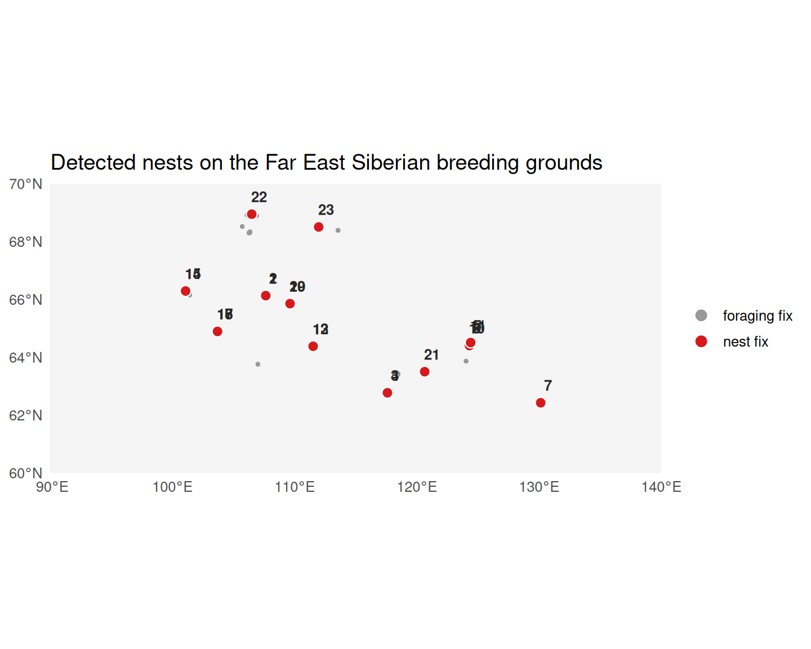

# Nest Detection with Stratified ST-DBSCAN

## Overview

[`detect_nests()`](https://EverTSZ.github.io/movepp/reference/detect_nests.md)
implements the **three-tier sigma-stratified ST-DBSCAN** algorithm of
the accompanying manuscript (Eq. 10). It exploits the fact that GPS
fixes during nesting are approximately bivariate-normally distributed
around the true nest location:

- ~95% of fixes within 2σ of the centre
- ~68% within 1σ
- ~38% within 0.5σ

A point is classified as a nest fix only if it survives the density
threshold at all three sigma tiers simultaneously, yielding markedly
fewer false positives than single-tier DBSCAN.

## Recover the breeding subset from the upstream pipeline

Rather than hard-coding latitude or month thresholds, we reuse the phase
classification from vignettes 01-04: the breeding-phase habitats are the
ones with the highest mean MPI score in the phase classification voting
output.

``` r

library(movepp)
library(sf)
#> Linking to GEOS 3.12.1, GDAL 3.8.4, PROJ 9.4.0; sf_use_s2() is TRUE
library(ggplot2)
data("godwit_demo")

godwit <- compute_step_speed(godwit_demo,
                              time_col       = "time",
                              individual_col = "individual",
                              direction      = "centered")

seg <- balm_segmentation(godwit,
                          variable_col    = "step_speed",
                          individual_col  = "individual",
                          verbose         = FALSE)

stationary   <- seg[!is.na(seg$cluster_type) & seg$cluster_type %in% c("LL", "LH"), ]
p    <- detect_habitat_params(stationary, track = seg,
                              individual_col = "individual", time_col = "time")
#> eps    = 0.656 km  (migratory; 0.95-quantile of 2-comp GMM; flight/eps gap 306x)
#> minPts = 15  (~1.88 d min residence at 3.0 h sampling; knee)
hab  <- dbscan_habitats(stationary,
                        individual_col = "individual",
                        eps = p$eps, minPts = p$minPts)
mpi  <- compute_mpi(hab, individual_col = "individual",
                    time_col = "time", verbose = FALSE)
phs  <- classify_phases(mpi, n_phases = 3, individual_col = "individual")
#> [classify_phases] 3 phase(s); peaks {0.035, 0.635, 0.964}; cut(s) {0.220, 0.846}; sizes {19963, 18973, 8016}; mean MPI {0.042, 0.615, 0.960}

# Map ascending-MPI phase labels to biological names
ph_df    <- sf::st_drop_geometry(phs)
ph_order <- names(sort(tapply(ph_df$mpi, ph_df$phase, mean, na.rm = TRUE)))
phase_map <- setNames(c("wintering", "stopover", "breeding"), ph_order)
phs$phase_named <- factor(phase_map[as.character(phs$phase)],
                          levels = c("wintering", "stopover", "breeding"))

breeding <- phs[!is.na(phs$phase_named) & phs$phase_named == "breeding", ]

cat("Breeding-phase fixes:", nrow(breeding), "\n")
#> Breeding-phase fixes: 8018
cat("Date range:", format(range(breeding$time)), "\n")
#> Date range: 2023-05-18 13:00:00 2025-08-02 22:00:00
```

## Project to a metric CRS

[`detect_nests()`](https://EverTSZ.github.io/movepp/reference/detect_nests.md)
requires coordinates in metres so that `search_dist` has a physical
interpretation. UTM 52N covers the Vilyuy / Lena breeding range:

``` r

breeding_utm <- sf::st_transform(breeding, 32652)
```

## Run detect_nests

With a 3-hour sampling interval, ~30 fixes cover roughly 4 days of
continuous nest attendance — a reasonable lower bound. `search_dist` is
relaxed to 50 m to absorb GPS positional noise on individual fixes.

``` r

res <- detect_nests(breeding_utm,
                    time_col       = "time",
                    individual_col = "individual",
                    min_pts        = 30L,
                    search_dist    = 50,
                    time_window    = "3 weeks",
                    verbose        = FALSE)

res$nests
#> Simple feature collection with 23 features and 8 fields
#> Geometry type: POINT
#> Dimension:     XY
#> Bounding box:  xmin: -718700.4 ymin: 6922243 xmax: 558229.4 ymax: 7813445
#> Projected CRS: WGS 84 / UTM zone 52N
#> First 10 features:
#>    nest_id                individual n_points          start_time
#> 1        1 Black-tailed Godwit 23_02       82 2024-05-23 22:00:00
#> 2        2 Black-tailed Godwit 23_02       64 2023-05-30 22:00:00
#> 3        3 Black-tailed Godwit 23_03       52 2024-05-20 01:00:00
#> 4        4 Black-tailed Godwit 23_03      116 2023-05-18 13:00:00
#> 5        5 Black-tailed Godwit 23_05       12 2025-06-15 16:00:00
#> 6        6 Black-tailed Godwit 23_05       16 2025-05-26 04:00:00
#> 7        7 Black-tailed Godwit 23_05       23 2024-06-24 20:00:00
#> 8        8 Black-tailed Godwit 23_05       98 2024-05-20 00:00:00
#> 9        9 Black-tailed Godwit 23_05       29 2024-05-31 06:00:00
#> 10      10 Black-tailed Godwit 23_05       13 2023-06-08 10:00:00
#>               end_time           mean_time        lon     lat
#> 1  2024-06-23 07:00:00 2024-06-10 18:29:18 -449711.35 7498963
#> 2  2023-06-25 22:00:00 2023-06-13 12:37:30 -449712.21 7498964
#> 3  2024-06-14 19:00:00 2024-05-30 15:28:55  -80419.48 7011837
#> 4  2023-06-25 07:00:00 2023-06-06 12:11:55  -80375.95 7011793
#> 5  2025-06-28 16:00:00 2025-06-21 11:45:05  277498.60 7160652
#> 6  2025-06-17 07:00:00 2025-06-05 09:03:45  273474.82 7150405
#> 7  2024-06-29 14:00:00 2024-06-26 22:57:23  558229.36 6922243
#> 8  2024-06-23 04:00:00 2024-06-07 23:34:18  273464.01 7150390
#> 9  2024-06-23 00:00:00 2024-06-14 10:20:41  273930.38 7150427
#> 10 2023-06-28 10:00:00 2023-06-18 04:55:23  273481.71 7150406
#>                     geometry
#> 1  POINT (-449711.3 7498963)
#> 2  POINT (-449712.2 7498964)
#> 3  POINT (-80419.48 7011837)
#> 4  POINT (-80375.95 7011793)
#> 5   POINT (277498.6 7160652)
#> 6   POINT (273474.8 7150405)
#> 7   POINT (558229.4 6922243)
#> 8     POINT (273464 7150390)
#> 9   POINT (273930.4 7150427)
#> 10  POINT (273481.7 7150406)
```

``` r

cat("Fixes assigned to a nest:", sum(!is.na(res$points$nest_id)), "\n")
#> Fixes assigned to a nest: 1179
cat("Foraging-area fixes:     ", sum( is.na(res$points$nest_id)), "\n")
#> Foraging-area fixes:      6839
```

## Map: detected nests on the breeding grounds

We transform the nest centroids and the classified fixes back to WGS 84
and map them over the Far East Siberian breeding range (60–70 °N, 90–140
°E). Nest fixes (red) form tight cores within the looser cloud of
foraging fixes (grey); each nest centroid is labelled with its
`nest_id`.

``` r

world    <- rnaturalearth::ne_countries(scale = "medium", returnclass = "sf")
pts_ll   <- sf::st_transform(res$points, 4326)
pts_ll$is_nest <- !is.na(pts_ll$nest_id)
nests_ll <- sf::st_transform(res$nests, 4326)
nc       <- sf::st_coordinates(nests_ll)
nests_ll$lon <- nc[, 1]; nests_ll$lat <- nc[, 2]

ggplot() +
  geom_sf(data = world, fill = "grey96", colour = "grey80", linewidth = 0.2) +
  geom_sf(data = pts_ll, aes(colour = is_nest), size = 0.7, alpha = 0.6) +
  geom_sf(data = nests_ll, shape = 21, fill = "#D7191C",
          colour = "white", size = 3, stroke = 0.6) +
  geom_text(data = nests_ll, aes(lon, lat, label = nest_id),
            nudge_y = 0.6, nudge_x = 0.6, size = 3.4,
            fontface = "bold", colour = "grey15") +
  scale_colour_manual(values = c(`TRUE` = "#D7191C", `FALSE` = "grey60"),
                      labels = c(`TRUE` = "nest fix", `FALSE` = "foraging fix"),
                      name = NULL) +
  coord_sf(xlim = c(90, 140), ylim = c(60, 70), expand = FALSE) +
  guides(colour = guide_legend(override.aes = list(size = 3, alpha = 1))) +
  labs(title = "Detected nests on the Far East Siberian breeding grounds",
       x = NULL, y = NULL) +
  theme_minimal(base_size = 12)
```



ST-DBSCAN nest detections on the Siberian breeding grounds. Red points
are nest fixes, grey are foraging fixes; labels mark each nest centroid.

## Why three tiers?

Default `sigma_ratios = c(1.0, 0.68, 0.38)` (paired with internal
distance multipliers `c(1.0, 0.5, 0.25)`) follow the bivariate-normal
geometry of GPS fixes around a true nest. The stratified test — density
requirements satisfied at ALL three radii — sharply discriminates true
nest fixes from loose foraging clusters that might satisfy a single-tier
test but lack the tight inner core.

## Synthetic-data illustration

For a clean algorithm demonstration with known ground truth, simulate a
nest cluster surrounded by foraging fixes:

``` r

set.seed(42)
n_nest <- 200
n_off  <- 100
pts_syn <- sf::st_as_sf(data.frame(
  lon  = c(rnorm(n_nest, 0, 3), rnorm(n_off, 0, 150)),
  lat  = c(rnorm(n_nest, 0, 3), rnorm(n_off, 0, 150)),
  time = seq.POSIXt(as.POSIXct("2023-05-15"),
                    by = "1 hour", length.out = 300),
  individual = "synthetic_bird"
), coords = c("lon", "lat"), crs = 32633)

detect_nests(pts_syn, "time", "individual",
             min_pts = 40L, search_dist = 30,
             time_window = "3 weeks")$nests
```

With hourly sampling and a tight 3-m cluster, the algorithm recovers the
nest centre to sub-metre precision. On real 3-hour-interval data the
parameters are relaxed (50 m, 30 points) to accommodate GPS noise and
the coarser temporal grid.

## Cross-validate with `nestR`

``` r

remotes::install_github("picardis/nestR")
library(nestR)
nestR_result <- find_nests(gps_data = your_data, buffer = 10)
```

A side-by-side accuracy comparison on labelled data is provided in the
`paper-analyses/` companion repository.

## See also

- [`vignette("v04-mpi-phases")`](https://EverTSZ.github.io/movepp/articles/v04-mpi-phases.md)
  — produces the phase labels (upstream)
- [`vignette("v06-isfi")`](https://EverTSZ.github.io/movepp/articles/v06-isfi.md)
  — uses the `nests` output to compute INFI

``` r

sessionInfo()
#> R version 4.6.0 (2026-04-24)
#> Platform: x86_64-pc-linux-gnu
#> Running under: Ubuntu 24.04.4 LTS
#> 
#> Matrix products: default
#> BLAS:   /usr/lib/x86_64-linux-gnu/openblas-pthread/libblas.so.3 
#> LAPACK: /usr/lib/x86_64-linux-gnu/openblas-pthread/libopenblasp-r0.3.26.so;  LAPACK version 3.12.0
#> 
#> locale:
#>  [1] LC_CTYPE=C.UTF-8       LC_NUMERIC=C           LC_TIME=C.UTF-8       
#>  [4] LC_COLLATE=C.UTF-8     LC_MONETARY=C.UTF-8    LC_MESSAGES=C.UTF-8   
#>  [7] LC_PAPER=C.UTF-8       LC_NAME=C              LC_ADDRESS=C          
#> [10] LC_TELEPHONE=C         LC_MEASUREMENT=C.UTF-8 LC_IDENTIFICATION=C   
#> 
#> time zone: UTC
#> tzcode source: system (glibc)
#> 
#> attached base packages:
#> [1] stats     graphics  grDevices utils     datasets  methods   base     
#> 
#> other attached packages:
#> [1] ggplot2_4.0.3 sf_1.1-1      movepp_0.1.4 
#> 
#> loaded via a namespace (and not attached):
#>  [1] gtable_0.3.6            jsonlite_2.0.0          dplyr_1.2.1            
#>  [4] compiler_4.6.0          tidyselect_1.2.1        Rcpp_1.1.1-1.1         
#>  [7] scales_1.4.0            yaml_2.3.12             fastmap_1.2.0          
#> [10] dbscan_1.2.5            R6_2.6.1                generics_0.1.4         
#> [13] classInt_0.4-11         s2_1.1.11               knitr_1.51             
#> [16] tibble_3.3.1            units_1.0-1             DBI_1.3.0              
#> [19] pillar_1.11.1           RColorBrewer_1.1-3      rlang_1.2.0            
#> [22] xfun_0.58               S7_0.2.2                rnaturalearth_1.2.0    
#> [25] otel_0.2.0              cli_3.6.6               withr_3.0.2            
#> [28] magrittr_2.0.5          wk_0.9.5                class_7.3-23           
#> [31] digest_0.6.39           grid_4.6.0              mclust_6.1.2           
#> [34] lifecycle_1.0.5         vctrs_0.7.3             KernSmooth_2.23-26     
#> [37] proxy_0.4-29            evaluate_1.0.5          glue_1.8.1             
#> [40] farver_2.1.2            rnaturalearthdata_1.0.0 e1071_1.7-17           
#> [43] rmarkdown_2.31          tools_4.6.0             pkgconfig_2.0.3        
#> [46] htmltools_0.5.9
```
